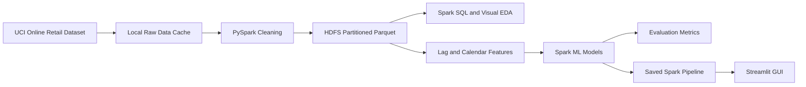

# Demand Forecasting Model using PySpark

## 1. Project Overview

The goal of this project is to predict e-commerce product demand using PySpark. Demand forecasting helps reduce stockouts, improve inventory planning, and support better supply-chain decisions.

The project uses the UCI Online Retail dataset, which contains transactional sales records for an online retailer. The workflow covers ingestion, cleaning, storage in HDFS, EDA, feature engineering, model training, model evaluation, optimization, deployment, and monitoring.

## 2. Team Responsibilities

| Member | Assigned Role | Main Responsibility |
| --- | --- | --- |
| Mahmoud Ahmed | Data Engineer and Big Data Engineer | Data ingestion, HDFS storage, Spark partitioning, caching, and performance optimization |
| Mohamed ElSayed | Machine Learning Engineer | Feature engineering, model training, model comparison, and evaluation |
| Abdelrahman Ayman | Data Analyst | Exploratory analysis, trend analysis, and visualizations |
| Seif Ihab | MLOps Engineer | Streamlit deployment, saved model usage, monitoring plan, and production workflow |

Mahmoud has two roles because the project defines five roles but the team has four members.

## 3. Architecture



## 4. Dataset

The project uses the UCI Online Retail dataset:

- Source: `https://archive.ics.uci.edu/ml/machine-learning-databases/00352/Online%20Retail.xlsx`
- Format: Excel workbook downloaded by the notebook.
- Important fields: `InvoiceNo`, `StockCode`, `Description`, `Quantity`, `InvoiceDate`, `UnitPrice`, `CustomerID`, and `Country`.

The notebook converts the Excel file to CSV before Spark ingestion because CSV is easier to read with a standard PySpark installation.

## 5. Data Engineering

The ingestion and cleaning pipeline:

1. Download the dataset into `data/raw/`.
2. Convert Excel to `data/raw/online_retail.csv`.
3. Load the CSV with Spark using schema inference and an explicit Spark-compatible `file://` URI because the default filesystem is HDFS.
4. Convert invoice dates to timestamps and dates.
5. Remove cancelled invoices, negative quantities, zero prices, and missing critical fields.
6. Create revenue and calendar fields.
7. Write clean data to HDFS as partitioned Parquet.

The cleaned dataset is stored at:

```text
hdfs://localhost:9000/demand_forecasting/processed/clean_online_retail_parquet
```

## 6. HDFS Setup

HDFS is provided locally through Docker Compose:

- `docker-compose.hdfs.yml` runs one NameNode and one DataNode.
- `hadoop.env` configures HDFS and disables strict permissions for local development.
- `scripts/hdfs_bootstrap.sh` starts the services and creates the project directories.

Run:

```bash
bash scripts/hdfs_bootstrap.sh
```

Open the NameNode UI:

```text
http://localhost:9870
```

The local HDFS setup uses replication factor 1 because there is one DataNode. In a real cluster, replication factor 3 is commonly used for fault tolerance.

## 7. Exploratory Data Analysis

The notebook answers these questions:

- Which products have the highest demand?
- Which countries generate the most revenue?
- How does demand change by month?
- Are there visible seasonal patterns?

Generated visualizations are saved in `outputs/`, including:

- `top_products_and_countries.png`
- `monthly_demand_trend.png`
- `actual_vs_predicted_demand.png`

## 8. Feature Engineering

The forecasting target is daily product demand: `TotalQuantity`.

Features include:

- Product and country indexes.
- Day of week.
- Month.
- Weekend flag.
- Day index.
- Previous-day demand.
- Demand from seven days ago.
- Seven-day rolling average demand.
- Invoice count.

The notebook uses only historical lag and rolling features so the model does not use future or same-day target information.

## 9. Model Development

The notebook trains and compares:

- Linear Regression.
- Random Forest Regressor.
- Gradient Boosted Trees Regressor.

The data split is time-aware. Older dates are used for training and later dates are used for testing.

Evaluation metrics:

- RMSE: penalizes large errors.
- MAE: average absolute error.
- R2: explained variance.

The best model is saved to:

```text
models/best_demand_forecasting_model
```

## 10. Big Data Optimization

Optimization choices:

- Adaptive query execution is enabled.
- Cleaned data is stored as Parquet.
- HDFS output is partitioned by `YearMonth`.
- Repartitioning is used before writing to distribute files.
- Reused DataFrames are cached.
- The train/test split is time-aware to avoid leakage.

## 11. Deployment

The deployment GUI is implemented in Streamlit:

```bash
streamlit run streamlit_app.py
```

The app:

- Loads model metrics from `outputs/model_metrics.csv`.
- Loads the saved Spark ML pipeline from `models/best_demand_forecasting_model`.
- Accepts product, country, calendar, lag, rolling, and invoice-count inputs.
- Returns the predicted daily demand.

## 12. Monitoring Plan

The monitoring plan tracks:

- Prediction row counts.
- Average actual demand.
- Average predicted demand.
- Average absolute error.
- Prediction date range.
- Model quality metrics after retraining.

The notebook writes a monitoring summary to:

```text
outputs/monitoring_summary.csv
```

Recommended alerts:

- Input row count is much lower or higher than usual.
- RMSE or MAE increases beyond a chosen threshold.
- Product mix or country mix changes sharply.
- Missing values increase.

## 13. How to Run

1. Activate the virtual environment.
2. Ensure Java 17 or Java 21 is active. The notebook automatically uses the project-local Java 21 runtime under `.jdk/` when it exists.
3. Start HDFS with `bash scripts/hdfs_bootstrap.sh`.
4. Run `jupyter lab demand_forecasting_pyspark.ipynb`.
5. Run all notebook cells.
6. Start the GUI with `streamlit run streamlit_app.py`.

## 14. Limitations and Future Work

Limitations:

- The local HDFS setup uses one DataNode, so replication is only simulated for development.
- The notebook depends on a compatible local Java version.
- Product-date gaps are not fully expanded into a complete daily panel.

Future work:

- Add holiday and promotion features.
- Use hyperparameter tuning.
- Add MLflow experiment tracking.
- Deploy the Streamlit app to a server.
- Run the Spark job on a real cluster or cloud platform.
